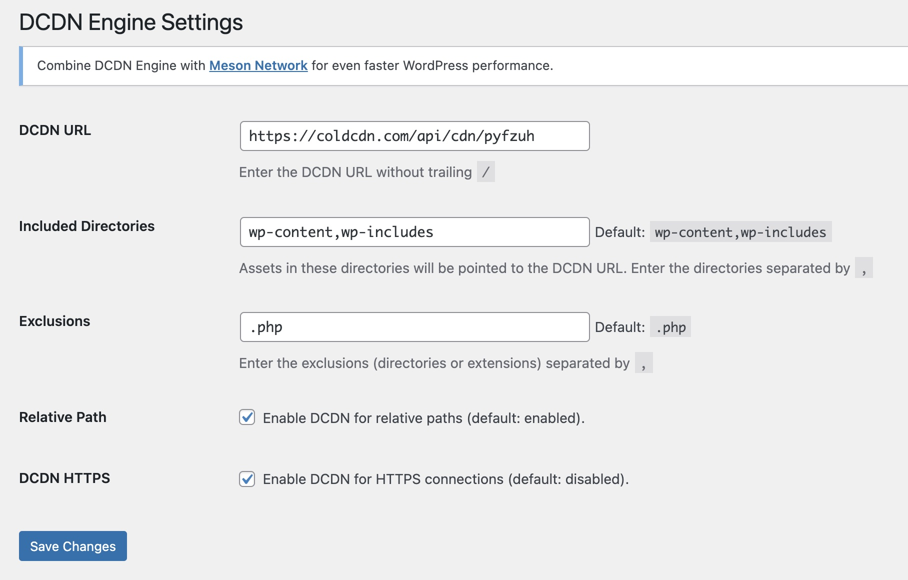
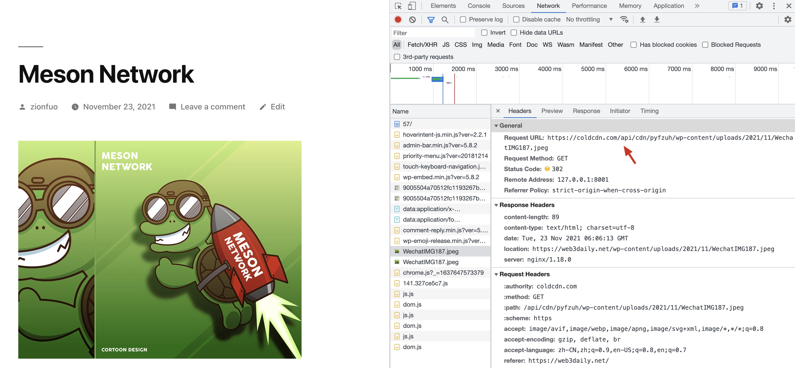

# DCDN Engine - WordPress DCDN Plugin

Simply integrate a Distributed Content Delivery Network (DCDN) into your WordPress site.

## Preview Plugin

### Installation


### Configuration




```
DCDN URL: https://coldcdn.com/api/cdn/xxxxxx

Included Directories: wp-content,wp-includes

Exclusions: .php
```

### Demo



## Contribute

* Anyone is welcome to contribute to the plugin on [GitHub](https://github.com/daqnext/dcdn-engine).
* Please merge (squash) all your changes into a single commit before you open a pull request.